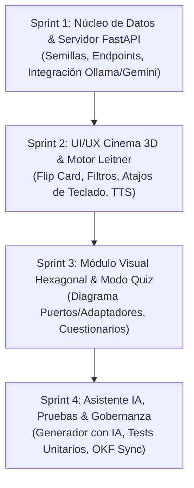

# 📋 BACKLOG OFICIAL DE PRODUCTO: DEVCARDS AI (PLATAFORMA DE APRENDIZAJE NEMOTÉCNICO)

> **Visión del Producto**:
> Aplicación web moderna y dinámica orientada al aprendizaje activo, memorización y comprensión intuitiva de conceptos fundamentales y avanzados de ciencias de la computación e ingeniería de software (POO, Nodos, Estructuras de Datos, Arquitectura Hexagonal, Principios SOLID y Patrones de Diseño).
> Cuenta con asistencia de Inteligencia Artificial (Ollama local / Gemini Cloud) para generar nuevas tarjetas a demanda y explicar conceptos mediante analogías de la vida real.

---

## 🎯 1. Casos de Uso del Sistema (Casos de Uso Formales)

```
┌─────────────────────────────────────────────────────────────────────────────┐
│                       DIAGRAMA DE CASOS DE USO                              │
│                                                                             │
│   [ Usuario / Estudiante ]                                                  │
│         │                                                                   │
│         ├──► CU-01: Explorar y Filtrar Tarjetas por Categoría               │
│         ├──► CU-02: Practicar en Modo Flashcard 3D Interactiva              │
│         ├──► CU-03: Realizar Repaso Espaciado (Sistema Leitner)             │
│         ├──► CU-04: Explorar el Visualizador de Arquitectura Hexagonal     │
│         ├──► CU-05: Ponerse a Prueba en Modo Quiz / Evaluación              │
│         ├──► CU-06: Generar Tarjetas Dinámicas con IA (Ollama / Gemini)     │
│         ├──► CU-07: Solicitar "Explícamelo con una Analogía Cotidiana"      │
│         └──► CU-08: Escuchar la Tarjeta en Audio (Voz Sintetizada)          │
└─────────────────────────────────────────────────────────────────────────────┘
```

### Especificación Detallada de Casos de Uso:

#### CU-01: Explorar y Filtrar Tarjetas por Categoría
* **Actor Principal**: Desarrollador / Estudiante.
* **Precondición**: La aplicación está cargada en el navegador.
* **Flujo Principal**:
  1. El usuario visualiza la barra de categorías: *Todos, POO, Nodos y Estructuras, Arquitectura Hexagonal, Principios SOLID, Patrones GoF, Algoritmos Big O*.
  2. El usuario selecciona una categoría o escribe una palabra en el buscador en tiempo real.
  3. El sistema filtra instantáneamente el mazo de tarjetas en pantalla mostrando contador de resultados.
* **Postcondición**: Se despliegan solo las tarjetas que coinciden con los criterios de búsqueda.

#### CU-02: Practicar en Modo Flashcard 3D Interactiva
* **Actor Principal**: Desarrollador.
* **Flujo Principal**:
  1. El usuario visualiza el anverso de la tarjeta (Concepto, Categoría, Nivel de Dificultad e Icono).
  2. El usuario hace clic sobre la tarjeta o presiona la **Barra Espaciadora**.
  3. La tarjeta gira suavemente con animación 3D (*flip card*) revelando el reverso:
     - Definición concisa y precisa.
     - Analogía intuitiva de la vida cotidiana.
     - Snippet de código canónico (Python / Java / TypeScript).
  4. El usuario puede navegar a la siguiente tarjeta con las flechas del teclado o botones en pantalla.

#### CU-03: Realizar Repaso Espaciado (Algoritmo Leitner)
* **Actor Principal**: Desarrollador.
* **Flujo Principal**:
  1. Tras voltear la tarjeta, el usuario califica su dominio con tres botones:
     - 🔴 **Difícil** (Nivel 1: Se repite en la misma sesión).
     - 🟡 **Dudoso** (Nivel 2: Se repite pronto).
     - 🟢 **Fácil / Dominado** (Nivel 3: Pasa a la caja de dominados).
  2. El sistema actualiza la barra de progreso general y calcula la racha (*streak*) de estudio.

#### CU-04: Explorador Visual Interactivo de Arquitectura Hexagonal
* **Actor Principal**: Desarrollador / Arquitecto.
* **Flujo Principal**:
  1. El usuario ingresa a la pestaña especial **"Arquitectura Hexagonal"**.
  2. Se renderiza un diagrama hexagonal interactivo con 3 capas concéntricas:
     - **Capa Central (Dominio / Núcleo)**: Entidades y Reglas de Negocio puras.
     - **Capa Intermedia (Puertos)**: Interfaces de Entrada (Driving) y Salida (Driven).
     - **Capa Exterior (Adaptadores)**: Controladores Web/REST, Repositorios DB, Mensajería.
  3. El usuario hace clic sobre cualquier zona para ver su explicación, el porqué de la inversión de dependencias y código de ejemplo desacoplado.

#### CU-06: Generar Nuevas Tarjetas mediante IA (Ollama / Gemini)
* **Actor Principal**: Desarrollador.
* **Flujo Principal**:
  1. El usuario abre el modal "Crear con IA" e ingresa un tema (ej: *"Inversión de Control vs Inyección de Dependencias"* o *"Árboles AVL"*).
  2. El sistema envía la petición al backend (`/api/generate-ai`).
  3. El backend consulta a Ollama local (`localhost:11434`) con fallback a Gemini o generador semántico.
  4. La IA devuelve la tarjeta estructurada (título, definición, analogía, código y preguntas de quiz).
  5. La nueva tarjeta se incorpora al mazo del usuario y se almacena en memoria local.

---

## ⚙️ 2. Requisitos del Sistema

### Requisitos Funcionales (RF):
* **RF-01 (Mazo Pre-cargado de Semillas)**: La aplicación debe incluir de fábrica al menos **40 tarjetas pedagógicas de alta calidad** cubriendo POO, Nodos, Listas Enlazadas, Pilas, Colas, Árboles, Tablas Hash, Grafos, Arquitectura Hexagonal, Clean Architecture, SOLID, Patrones GoF y Big O.
* **RF-02 (Volteo 3D y Atajos de Teclado)**: El usuario debe poder voltear la tarjeta con clic o Barra Espaciadora, y navegar con las flechas `←` y `→`.
* **RF-03 (Búsqueda y Filtros Instantáneos)**: Filtro por categorías temáticas y búsqueda difusa en tiempo real por título o palabras clave.
* **RF-04 (Algoritmo de Repaso Espaciado)**: Clasificación de tarjetas en cajas de aprendizaje (Difícil, Dudoso, Dominado) con persistencia en `localStorage`.
* **RF-05 (Modo Quiz / Autoevaluación)**: Cuestionario interactivo con preguntas de opción múltiple generadas a partir del reverso de las tarjetas.
* **RF-06 (Visualizador Gráfico de Arquitectura Hexagonal)**: Módulo dedicado con diagrama explicativo de Puertos y Adaptadores.
* **RF-07 (Integración Dual con IA)**: Conexión con Ollama local (`/api/generate`) y Google Gemini API como fallback resiliente.
* **RF-08 (Modo Analogía)**: Botón para solicitar a la IA que re-explique el concepto con una metáfora sencilla de la vida diaria.
* **RF-09 (Lectura por Voz / TTS)**: Botón para escuchar la definición en audio utilizando la Web Speech API nativa del navegador.
* **RF-10 (Creación y Edición Manual)**: Formulario para que el usuario agregue sus propias tarjetas personalizadas.
* **RF-11 (Exportación e Importación JSON)**: Capacidad de exportar el mazo de tarjetas a archivo `.json` y restaurarlo.
* **RF-12 (Métricas de Estudio)**: Contador de tarjetas estudiadas, porcentaje de dominio y racha de días activos.

### Requisitos No Funcionales (RNF):
* **RNF-01 (Diseño Visual de Primer Nivel - Rich Aesthetics)**: Interfaz oscura premium (Deep Space Dark Theme: `#0b0f19`, fondos translúcidos con `backdrop-filter: blur(16px)`, sombras neón sutiles y tipografía moderna Inter y JetBrains Mono).
* **RNF-02 (Rendimiento Extremo)**: Tiempo de carga inicial inferior a 500 ms; animaciones de volteo a 60 FPS sin parpadeos.
* **RNF-03 (Tolerancia a Desconexión / Offline First)**: La aplicación debe funcionar al 100% sin conexión a internet utilizando el catálogo pre-cargado y LocalStorage.
* **RNF-04 (Compatibilidad Multiplataforma y Responsividad)**: Diseño 100% responsivo adaptable a monitores panorámicos de escritorio, laptops y dispositivos móviles.
* **RNF-05 (Arquitectura Limpia en Backend)**: Backend en FastAPI con separación modular entre routers, servicios de IA y almacenamiento.
* **RNF-06 (Cero Dependencias Externas Complejas para el Frontend)**: Frontend construido en HTML5, CSS3 moderno (Custom Properties, Grid, Flexbox, 3D Transform) y Vanilla JavaScript ES6+ sin requerir compiladores pesados de node_modules para ejecutarse.
* **RNF-07 (Trazabilidad y Gobernanza OKF)**: Manifiesto `AGENTS.md` alineado al estándar de fábrica v0.2.
* **RNF-08 (Seguridad)**: Sanitización estricta de entradas en tarjetas personalizadas para prevenir ataques XSS.

---

## 🏃 3. Plan de Sprints de Desarrollo



* **Sprint 1 (Backend & Catálogo Semilla)**: API REST con FastAPI, base de datos de 40+ tarjetas en JSON, router de IA para Ollama y Gemini.
* **Sprint 2 (Frontend Flashcards 3D & Leitner)**: Interfaz visual moderna, giro 3D de tarjetas, motor de repaso espaciado, síntesis de voz nativa.
* **Sprint 3 (Arquitectura Hexagonal & Modo Quiz)**: Visualizador interactivo de capas y puertos/adaptadores, motor de evaluación interactivo.
* **Sprint 4 (Generación IA, Tests & Gobernanza)**: Modal de generación con IA, pruebas unitarias automatizadas (`pytest`/`unittest`), sincronización en la Wiki de Obsidian.
